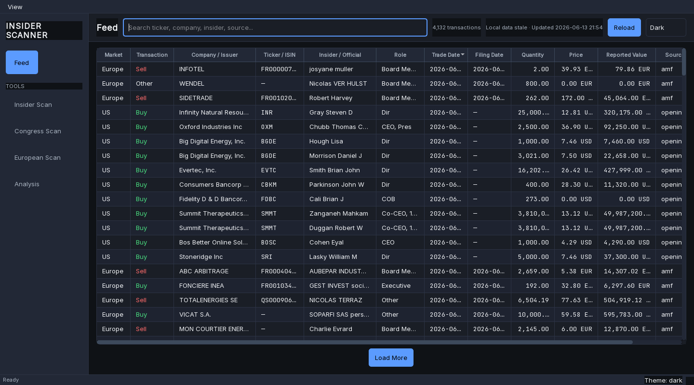
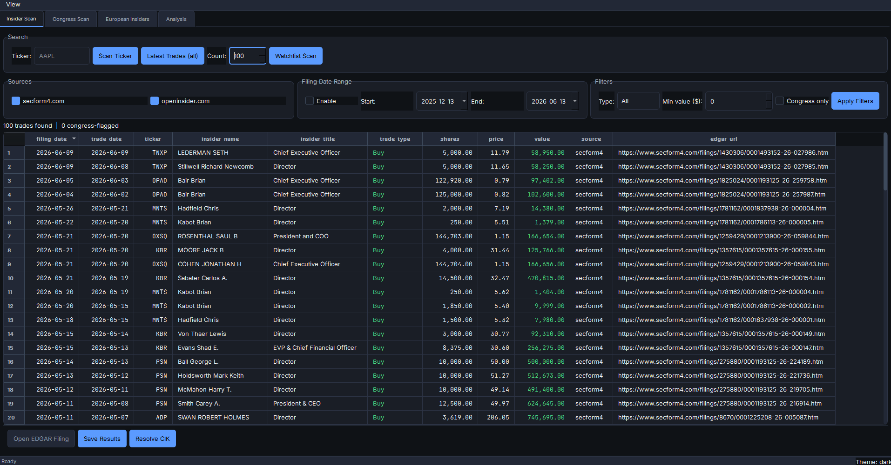
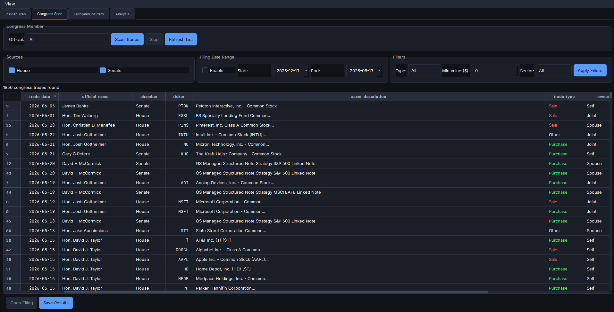
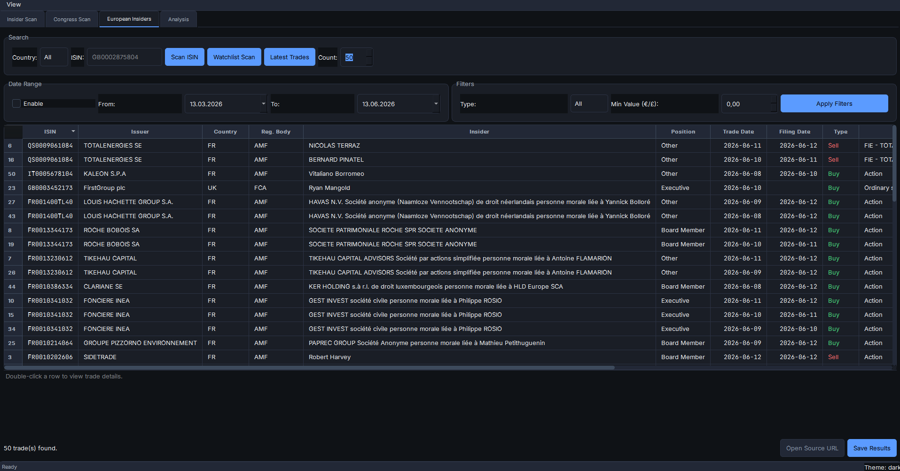
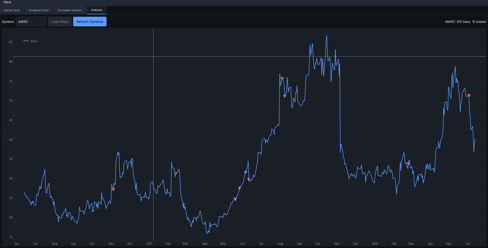

# Insider Scanner

[](https://pypi.org/project/insider-scanner/)
[](https://github.com/Czarnak/insider-scanner/actions/workflows/ci.yml)
[](https://pypi.org/project/insider-scanner/)
[](https://pepy.tech/project/insider-scanner)

Scan insider trades from **secform4.com**, **openinsider.com**, **SEC EDGAR**, and European regulators (FCA, BaFin, AMF, AFM). Includes congressional financial disclosure scanning (House and Senate), multi-source deduplication, committee-based sector filtering, and a desktop GUI with EDGAR filing links plus a European scan workspace.

## Install

Install the base package for the command-line interface:

```bash
pip install insider-scanner
insider-scanner-cli --help
```

Install the optional GUI dependencies for the desktop application:

```bash
pip install "insider-scanner[gui]"
insider-scanner
```

## Run

```bash
insider-scanner-cli --help # command-line interface
insider-scanner            # desktop GUI (requires the gui extra)
```

## Development Setup

```bash
git clone https://github.com/Czarnak/insider-scanner.git
cd insider-scanner
pip install -e ".[gui,dev]"
```

### Requirements

Python 3.11+. Core dependencies include `requests`, `beautifulsoup4`, `lxml`,
`pandas`, `pyyaml`, `pdfplumber`, `numpy`, `platformdirs`, and SQLAlchemy.
The `gui` extra adds `PySide6` and `pyqtgraph`.

---

## Usage

### GUI

```bash
insider-scanner
# or
python -m insider_scanner.main
```

The GUI opens on a unified, read-only **Feed** built from transactions already
stored in the local SQLite database. Left navigation keeps the acquisition and
analysis workflows available under **Tools**.

#### Unified Feed

- Combines US corporate, US Congress, and European transactions into one
  date-ordered timeline without copying or migrating persisted records.
- Searches ticker/ISIN, company or issuer, insider or official, role,
  transaction type, market, and source.
- Uses backend sorting and 200-row paging so large local datasets do not need
  to be loaded into memory.
- Shows local-data freshness, empty and error states, semantic transaction
  labels, and direct filing/source links.



#### Insider Scan tool

- Search a ticker and run both secform4.com and openinsider.com scrapers in one click.
- Fetch the latest trades (configurable count) and run watchlist scans backed by the user data directory's `tickers_watchlist.txt`.
- Toggle sources, specify a date range, trade type, minimum value, or Congress-only filter.
- View sortable tables that display filing/trade dates, highlight congressional filings, show EDGAR links, and let you export CSV/JSON.
- Cancel long-running scans and resolve any ticker to its SEC CIK + filing page.



#### Congress Scan tool

- Pick a legislator (House/Senate dropdown) or the whole committee list, select sources (House/Senate), and preview results in a threaded worker with progress + cancel.
- Use filters such as trade type, sector, and minimum value, then double-click any row to open the original PDF/PTR.
- Save filtered results to CSV/JSON, with exports reflecting the current filters.



#### European Scan tool

- Choose All/UK/DE/FR/NL, type an ISIN, or scan the user data directory's `eu_watchlist.txt`.
- Enable optional date bounds, filter by trade type and minimum value, and watch the progress bar while each ISIN is processed.
- Results are sortable, show normalized positions/currency, provide detail text on double-click, and allow opening the regulator source URL.
- Save filtered results to CSV/JSON (filename reflects the ISIN + country) or clear filters to adjust the view.



#### Analysis tool

- Select a US ticker from the dropdown list and click "Load Chart".
- Visualizes the past 2 years of daily price history using an interactive line graph with crosshairs.
- Overlays insider trade markers directly on the price line: corporate trades and congressional disclosures are both shown.
- Hover over trade markers to view detailed tooltips including insider name, role, trade size, and total value.
- The chart supports standard panning and zooming via pyqtgraph.



#### Appearance & themes

- A single semantic design-token system drives both **light** and **dark** themes (WCAG AA contrast).
- Switch from the top bar or **View ▸ Theme** (System / Light / Dark); the
  choice is remembered between sessions, and **System** follows the OS color
  scheme.
- Transaction colors are semantic and always paired with text/sign (green = purchase, red = sale, amber = flagged/congress); tickers, dates, and monetary values use a monospace face for tabular alignment.
- The UI bundles the open-source **Inter** (sans) and **JetBrains Mono** (monospace) fonts, falling back to system fonts (Segoe UI / Consolas) when unavailable.

### CLI

```bash
# Scan a specific ticker
insider-scanner-cli scan AAPL
insider-scanner-cli scan AAPL --type Buy --min-value 1000000 --save

# Scan with date range
insider-scanner-cli scan AAPL --since 2025-01-01 --until 2025-06-30

# Fetch latest insider trades
insider-scanner-cli latest --count 50 --save
insider-scanner-cli latest --since 2025-06-01 --until 2025-06-30

# Resolve SEC CIK
insider-scanner-cli resolve-cik AAPL

# Initialize default Congress member list
insider-scanner-cli init-congress

# Congress-only filter
insider-scanner-cli scan AAPL --congress-only

# Import legacy JSON exports into SQLite
insider-scanner-cli import-legacy ./old-exports
insider-scanner-cli import-legacy ./large.json --max-file-size-mib 100
```

### European scan CLI

```bash
# Scan a single ISIN or run the built-in watchlist
insider-scanner-cli eu-scan GB0002875804
insider-scanner-cli eu-scan --watchlist --country UK --min-value 50000 --save
```

Pass `--country` to restrict to `UK`/`DE`/`FR`/`NL` (default: `All`), `--type` to filter `Buy`/`Sell` trades, `--min-value` for the total reported value, and `--since`/`--until` for date bounds. Use `--watchlist` to scan every configured ISIN, and `--save` to persist the filtered CSV/JSON bundle.

### SEC EDGAR ingestion CLI

Ingest SEC ownership filings (Forms 3/4/5) directly from EDGAR into the local
database. These commands require a valid `SEC_USER_AGENT` (see SEC fair access
below) — the default placeholder contact email is rejected, so set it first:

```bash
# Required: your app/company name plus a real contact email
export SEC_USER_AGENT="MyApp/1.0 (you@example.com)"   # PowerShell: $env:SEC_USER_AGENT = "MyApp/1.0 (you@example.com)"

# Ingest one day (defaults to today; the SEC daily index lags ~1 business day)
insider-scanner-cli sec-daily --date 2026-06-15
insider-scanner-cli sec-daily --date 2026-06-15 --no-cleanup --quiet

# Ingest an inclusive date range (resumable; only uncovered days are fetched)
insider-scanner-cli sec-catchup --since 2026-06-01 --until 2026-06-15

# Full bulk backfill is not yet implemented (Session 7); this is a guarded placeholder
insider-scanner-cli sec-backfill --confirm-full-backfill
```

Ingestion is idempotent: completed days are recorded as covered, so re-running a
`sec-daily`/`sec-catchup` over already-ingested dates does not duplicate rows.
Per-date progress is written to stderr unless `--quiet`; recoverable per-filing
failures are reported in the summary without failing the command. Exit codes:
`0` success, `1` when `SEC_USER_AGENT` is misconfigured, `2` for an invalid range
or a `sec-backfill` invocation missing `--confirm-full-backfill`.

### Local persistence and paths

Parsed US, Congress, and European trades are stored in a local SQLite database.
Writable data, cache, watchlist, House disclosure, and export paths are resolved
with `platformdirs`; the application does not write runtime data into the source
checkout. Print the paths selected for the current OS and user with:

```bash
python -c "from insider_scanner.utils.config import DEFAULT_PATHS; print(DEFAULT_PATHS)"
```

The SQLite database stores normalized trade records, successful source/date
coverage, and latest-refresh state. HTTP caches remain transient files under the
platform cache directory and can be removed without deleting parsed trades.

For bounded scans, the service queries SQLite first, calculates uncovered
intervals independently for each source, fetches only those gaps, and then
returns the merged local result. Failed or cancelled intervals are not marked as
covered. AMF search bounds are publication dates rather than transaction dates,
so bounded French scans conservatively persist and filter returned trades but do
not mark the requested trade-date interval as covered. Repeating an AMF bounded
scan therefore rechecks the regulator. RNS, BaFin, and AFM bounded scans retain
normal coverage caching. Latest scans reuse a successful refresh for one hour by default;
different requested counts have independent refresh state. European latest mode
uses only sources with a latest endpoint. AFM remains available for bounded
Netherlands scans but is excluded from latest refreshes.

`import-legacy PATH` accepts a JSON file or recursively scans a directory for
JSON exports. Imports are validated, idempotent, do not modify source files, and
do not alter scan coverage or refresh state. Each file is limited to 50 MiB by
default; use `--max-file-size-mib` to set a different positive limit. Any
malformed, oversized, or invalid record produces a nonzero exit code.

Database initialization and migration failures stop GUI or CLI startup rather
than continuing with partial state. User-facing errors remain concise; detailed
diagnostics are sent through application logging.

#### Database migration recovery

The database is `insider_scanner.sqlite3` under the platform user data directory
reported by `DEFAULT_PATHS.database_file`. Typical locations are
`%LOCALAPPDATA%\Insider Scanner\Insider Scanner\` on Windows,
`~/Library/Application Support/Insider Scanner/` on macOS, and
`~/.local/share/Insider Scanner/` on Linux.

If startup reports a database or migration failure:

1. Close every Insider Scanner GUI and CLI process.
2. Back up `insider_scanner.sqlite3` before making any recovery change.
3. Do not edit `schema_version`, tables, indexes, or other schema objects manually.
4. Restore a known-good database backup, or rename the corrupt database and
   restart the application to build a fresh database.
5. Optionally repopulate the fresh database with
   `insider-scanner-cli import-legacy PATH` using validated legacy JSON exports.

---

## Architecture

```
src/insider_scanner/
├── core/
│   ├── models.py        # InsiderTrade + CongressTrade dataclasses
│   ├── secform4.py      # secform4.com scraper (compound-column parser, direct filing links)
│   ├── openinsider.py   # openinsider.com HTML parser + scraper
│   ├── edgar.py         # SEC EDGAR CIK resolver (JSON primary + HTML fallback) + filing URLs
│   ├── senate.py        # Congress member list + trade flagging
│   ├── congress_house.py # House financial disclosures (ZIP index + PTR PDF parsing)
│   ├── congress_senate.py # Senate EFD scraper (session + search + PTR page parsing)
│   ├── merger.py        # Multi-source dedup, filtering, export
│   ├── afm.py           # Dutch AFM API client
│   ├── amf.py           # French AMF BDIF API client
│   ├── bafin.py         # German BaFin download+CSV parser
│   ├── eu_models.py     # European trade dataclass + helpers
│   ├── eu_merger.py     # European dedup/filter/export helpers
│   ├── eu_scan.py       # Dispatcher that runs the selected European scrapers
│   └── rns_investegate.py # UK RNS announcements via Investegate
├── gui/
│   ├── main_window.py   # Main window (default OS style + tab management)
│   ├── scan_tab.py      # Insider scan workflow: search, filters, table, EDGAR links
│   ├── congress_tab.py  # Congress tab with sector filtering and save/export helpers
│   ├── european_tab.py  # European tab with ISIN/watchlist scans and detail panel
│   ├── analysis_tab.py  # Analysis tab integrating price history and trade markers
│   ├── price_chart.py   # PyQtGraph price chart widget with crosshairs and scatter overlays
│   └── widgets.py       # Pandas table model, sortable proxy, table helpers
├── persistence/
│   ├── schema.py        # SQLAlchemy Core table definitions
│   ├── bootstrap.py     # Versioned SQLite initialization and migrations
│   ├── repositories.py  # Immutable trade upserts and queries
│   ├── coverage.py      # Source-aware covered intervals and gap calculation
│   └── refresh.py       # Latest-scan freshness state
├── resources/
│   └── seeds/           # Packaged default watchlists and Congress members
├── services/
│   ├── application.py   # Shared GUI/CLI service composition
│   ├── us.py            # DB-first US scan orchestration
│   ├── congress.py      # DB-first Congress scan orchestration
│   ├── european.py      # DB-first European scan orchestration
│   └── importer.py      # Validated legacy JSON import
├── utils/
│   ├── config.py        # Paths, SEC/User-Agent constants, watchlists
│   ├── logging.py       # Logging setup
│   ├── caching.py       # File cache with TTL expiry
│   ├── http.py          # Rate-limited HTTP helper
│   └── threading.py     # Worker/Signal helpers for GUI
├── main.py              # GUI entry point
└── cli.py               # CLI entry point (scan, latest, EU, import)

scripts/
└── update_congress.py   # Fetch current federal + state legislators
```

### Data Flow — Insider Trades

1. **Resolve**: `edgar.py` resolves ticker → CIK via SEC `company_tickers.json` (cached 24h, HTML fallback)
2. **Scrape**: `secform4.py` fetches CIK-based pages with compound-column parsing (date+type, name+title split by `<br>`); `openinsider.py` fetches ticker-based pages; both produce `InsiderTrade` records
3. **Persist**: parsed records are upserted into SQLite; successful source/date intervals are recorded separately
4. **Cache**: raw HTTP responses are cached independently with configurable TTL (default 1h)
5. **Merge**: `merger.py` deduplicates trades across sources (matching by ticker + name + date + share count)
6. **Flag**: `senate.py` checks insider names against the Congress member list (fuzzy matching)
7. **Verify**: secform4 trades include direct SEC filing links; others get generated EDGAR search URLs
8. **Export**: results are saved as CSV + JSON under the platform user data directory

### Data Flow — Congress (House)

1. **Index**: `congress_house.py` downloads yearly ZIP archives from `disclosures-clerk.house.gov` containing XML indexes of all financial disclosure filings. Past years are cached permanently; current year can be refreshed on demand.
2. **Search**: XML index is parsed to find PTR (Periodic Transaction Report) filings matching the selected official and date range. Multi-year ranges download multiple indexes as needed.
3. **Fetch**: Individual PTR PDFs are downloaded and cached under `house_disclosures/{year}/pdfs/` in the platform user data directory.
4. **Parse**: `pdfplumber` extracts transaction tables from electronically-filed PDFs. Scanned/handwritten PDFs are detected and skipped.
5. **Convert**: Raw table rows are converted to `CongressTrade` records with parsed tickers (from asset descriptions), normalized amount ranges, owner codes, and transaction types.

### Data Flow — Congress (Senate)

1. **Session**: `congress_senate.py` establishes an authenticated session with `efdsearch.senate.gov` by accepting the prohibition agreement and obtaining a CSRF token.
2. **Search**: POST to the EFD JSON API with senator name, report type (PTR), and date range. Results include links to individual PTR pages. Paper filings (scanned PDFs) are automatically filtered out.
3. **Parse**: Each electronic PTR page contains an HTML table with columns for transaction date, owner, ticker, asset name, type, amount range, and comment. These are parsed via BeautifulSoup.
4. **Convert**: Transactions are converted to `CongressTrade` records. Tickers are read directly from the "Ticker" column when available; when the ticker is "--", it's extracted from the asset description (e.g. "Vanguard ETF (BND)" → BND).

### Data Flow — European Insider Trades (UK / DE / FR / NL)

1. **Search**: `rns_investegate` queries Investegate for UK Director/PDMR announcements; `bafin`, `amf`, and `afm` POST/GET the regulators' portals for Germany, France, and the Netherlands respectively, honoring optional date bounds and ISIN filters.
2. **Parse**: Each scraper normalizes the (possibly localized) position text, currency formatting, and trade/filing dates before emitting `EuropeanInsiderTrade` records.
3. **Merge**: `eu_scan.scrape_eu_trades_for_isin` runs the requested sources, `eu_merger.merge_eu_trades` deduplicates across regulators, and `eu_merger.filter_eu_trades` applies the GUI/CLI filters (country, trade type, min value, date range).
4. **Save**: The European tab (and `eu-scan`) use `eu_merger.save_eu_results` to output labeled CSV/JSON bundles after the filters are applied.

### Price History & Analysis Tab

The application integrates daily price history from Yahoo Finance via an unofficial API using session handling, configurable user-agents, and exponential backoff to respect rate limits and bypass blocks.

1. **Fetch**: `insider_scanner.core.prices` requests adjusted daily price bars over a specified date range.
2. **Persist**: Price bars and missing gaps are cached locally in the `price_history` SQLite table.
3. **Visualize**: The **Analysis tab** merges local insider trades (`us_trades` and `congress_trades`) with the price history to provide an interactive visual overlay using `pyqtgraph`.
4. **Resilience**: The backend parser gracefully handles missing Yahoo data, challenge pages, malformed timestamps, and invalid JSON structures.

### Congress Tab — GUI Integration

The **Congress Scan** tab provides a full GUI workflow for scanning congressional financial disclosures:

- **Official selection**: searchable dropdown populated from `congress_members.json`, with an "All" option
- **Source checkboxes**: independently toggle House and Senate scrapers
- **Date range**: optional filing date filter
- **Filters**: trade type (Purchase/Sale/Exchange), minimum dollar amount, and committee-based sector filtering
- **Background scanning**: threaded execution with progress bar and cancellable stop button
- **Results table**: sortable columns for filing date, trade date, official, chamber, ticker, asset, type, owner, amount range, and source
- **Detail panel**: double-click a row to see full details including official's committee sectors
- **Open Filing**: launches the original disclosure page (House PDF or Senate PTR) in browser
- **Save**: exports filtered results to CSV + JSON

### SEC EDGAR Compliance

All EDGAR requests use a proper `User-Agent` header and are rate-limited to 10 requests/second as required by SEC policy. The User-Agent is configurable via the `SEC_USER_AGENT` environment variable.

---

## Runtime Files

| Location within runtime paths | Description |
| ------ | ------------- |
| `insider_scanner.sqlite3` | Parsed trades, coverage intervals, refresh state, and schema version |
| `congress_members.json` | Editable Congress member list with committee assignments and sector mappings |
| `tickers_watchlist.txt` | Editable ticker watchlist |
| `eu_watchlist.txt` | Editable European ISIN watchlist |
| `house_disclosures/` | Cached House disclosure indexes and PDFs |
| `exports/scans/` | Generated CSV/JSON scan exports |
| platform cache directory | Transient EDGAR and scraper HTTP caches |

Packaged defaults are copied into the user data directory only when a file is
missing; existing user edits are never overwritten. `eu_watchlist.txt` stores
one 12-character ISIN per line (comments start with `#`).

The Congress member list is populated by `scripts/update_congress.py` and includes committee assignments and sector mappings derived from the [unitedstates/congress-legislators](https://github.com/unitedstates/congress-legislators) project.

### Congress Data Model

Congress financial disclosures differ from standard insider trades. Instead of exact transaction values, they report dollar ranges (e.g. "$1,001 – $15,000"). The `CongressTrade` dataclass in `models.py` handles this with `amount_range` (original string), `amount_low` and `amount_high` (parsed floats), plus fields for `owner` (Self/Spouse/Dependent Child/Joint), `asset_description`, and `comment`.

### Committee → Sector Mapping

Each federal legislator is assigned one or more sectors based on their committee assignments. Committees are mapped to sectors via keyword matching (e.g. "Armed Services" → Defense, "Financial Services" → Finance). The available sectors are: Defense, Energy, Finance, Technology, Healthcare, Industrials, and Other. The `sector` field is a list — for example, a member serving on both Armed Services and Financial Services is tagged as `["Defense", "Finance"]`. "Other" is only included when no higher-priority sector applies.

**Limitation**: Family member financial disclosures (spouses, children) are not publicly machine-readable and would require paid data services. This is a known limitation documented here.

---

## Scripts

Standalone utility scripts live in `scripts/`.

### `update_congress.py`

Fetches the current list of federal and (optionally) state legislators, enriches them with committee assignments and sector mappings, and writes them to the configured `congress_members.json` in the platform user data directory.

```bash
# Federal only with committee enrichment (no API key needed)
python scripts/update_congress.py

# Federal + state legislators (requires free Open States API key)
OPENSTATES_API_KEY=your_key python scripts/update_congress.py --include-state

# Skip committee enrichment
python scripts/update_congress.py --no-committees

# Preview without saving
python scripts/update_congress.py --dry-run

# Custom output path
python scripts/update_congress.py --output /path/to/members.json
```

Federal data and committee assignments come from the [unitedstates/congress-legislators](https://github.com/unitedstates/congress-legislators) project (public domain, community-maintained YAML). State data uses the [Open States API](https://v3.openstates.org) (free key required).

---

## Contributing

We welcome contributions! Please see [CONTRIBUTING.md](CONTRIBUTING.md) for details on how to set up the development environment, run tests, and add new scraping sources.

---

## License

MIT

Bundled UI fonts are licensed separately under the SIL Open Font License 1.1:
[Inter](src/insider_scanner/resources/fonts/OFL-Inter.txt) and
[JetBrains Mono](src/insider_scanner/resources/fonts/OFL-JetBrainsMono.txt).

---

*Created with Claude AI*
